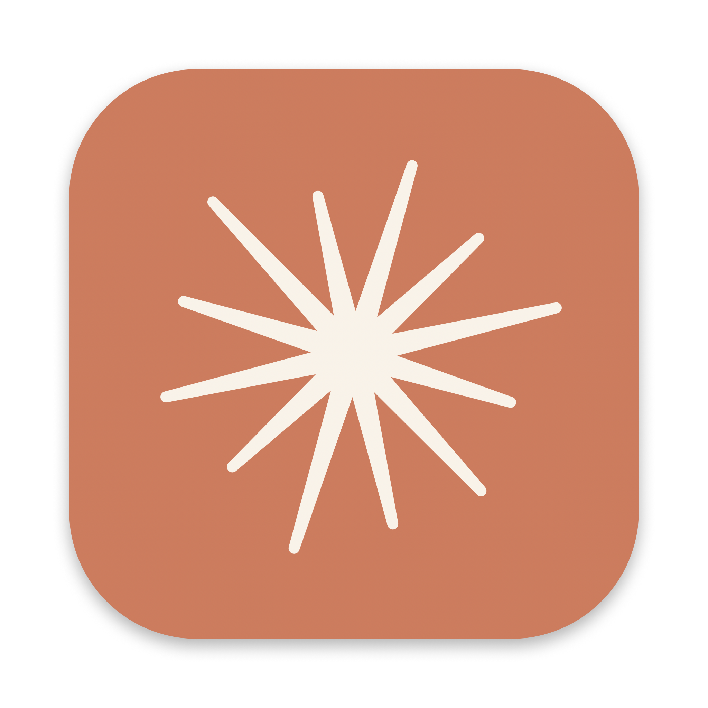
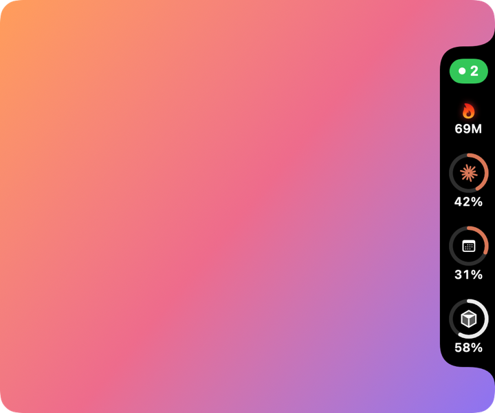

<div align="center">



# AiUsage

**Your AI coding usage, always in view.**<br>
A native macOS side widget for Claude Code and Cursor usage limits, running tasks and daily token burn.

[](#requirements)
[](AiUsage.swift)
[](#build-from-source)
[](LICENSE)

**English** · [Tiếng Việt](README.vi.md)



</div>

## Contents

- [Features](#features)
- [Requirements](#requirements)
- [Installation](#installation)
- [Usage](#usage)
- [Multiple accounts](#multiple-accounts)
- [How it works](#how-it-works)
- [Privacy & security](#privacy--security)
- [Troubleshooting](#troubleshooting)
- [Build from source](#build-from-source)
- [Disclaimer](#disclaimer)
- [License](#license)

## Features

| | Feature | Details |
| :-: | --- | --- |
| 🟠 | **Claude limits** | Usage of the 5-hour session and the weekly limit, plus the Opus/Sonnet weekly limits if your plan has them. Shows a countdown and the exact reset time in GMT+7. |
| ⚪ | **Cursor usage** | % of the included plan usage in the current billing cycle. *Experimental.* |
| 🟢 | **Running tasks** | Number of Claude Code sessions on this Mac that are working right now. |
| 🔥 | **Tokens today** | Total Claude Code tokens used today, with a breakdown of input, output and cache. The flame flickers faster while a task is running. |
| 👥 | **Multiple Claude accounts** | Each extra Claude Code profile (`CLAUDE_CONFIG_DIR`) gets a compact ring: the outer ring is the 5-hour limit, the inner ring is the weekly limit, and the account initial sits in the middle. Expired tokens are refreshed automatically. |
| 🔔 | **Smart notifications** | Alerts at 80% / 95%, when a limit resets, an early warning when your pace will run out before the reset, and when a Claude Code task finishes (with its name and duration). |
| 📈 | **Pace forecast** | Estimates your burn rate and when you would hit 100% at the current pace, for example *"~20%/h → hits 100% at 16:40, 1h before reset"*. |
| 📊 | **Token chart** | GitHub-style heatmaps of Claude Code tokens: by hour over the last 14 days, and by day over the last 6 months. Click the 🔥 counter to open it. You can exclude cache reads. |
| 🪟 | **Unobtrusive** | 40 px wide tab docked to the screen edge. Drag it up or down, pick a display, or keep it on the desktop only. |
| 🌐 | **Bilingual** | Vietnamese and English UI, independent of the macOS system language. |
| ⚡️ | **Lightweight** | Native SwiftUI + Core Animation with no dependencies. Uses about 0% CPU when idle. Single ~1 MB universal binary. |

It also adds a menu bar item that shows ✦ and the 5-hour %.

## Requirements

- macOS 14 Sonoma or later, on Apple Silicon or Intel
- [Claude Code](https://code.claude.com), signed in with a Pro, Max, Team or Enterprise account (`claude` → `/login`)
- *Optional:* [Cursor](https://cursor.com), signed in

## Installation

1. Download **`AiUsage.dmg`** from [Releases](https://github.com/RYG-Labs/AiUsage/releases), or [build it yourself](#build-from-source).
2. Open the DMG and drag **AiUsage** into **Applications**.
3. Allow the app on first launch. It is not notarized by Apple, so do one of the following:
   - Open it once, then go to **System Settings → Privacy & Security** and click **Open Anyway**.
   - Or run:
     ```bash
     xattr -dr com.apple.quarantine /Applications/AiUsage.app
     ```
4. If macOS asks for Keychain access to the Claude Code credentials, click **Always Allow**.
5. *Optional:* to start AiUsage at login, add it under **System Settings → General → Login Items**.

## Usage

| Action | Result |
| --- | --- |
| **Click** the tab | Open the settings menu, which also shows detailed usage |
| **Drag** the tab up or down | Move it along the screen edge. The position is remembered. |
| **Click** the 🔥 token counter | Open the token chart |
| **Hover** a ring or badge | Tooltip with used/remaining %, countdown and exact reset time |

### Settings menu

| Option | Description |
| --- | --- |
| Refresh | Fetch usage now |
| Show % remaining | Show remaining % instead of used % |
| Check limits every | How often the usage APIs are called: 1, 2, 5 (default), 10, 15 or 30 minutes |
| Always on top of other windows | Keep the tab above other windows. Turn it off to show the tab on the desktop only. |
| Language | Tiếng Việt / English |
| Show on display | Choose which monitor the tab is on. Only appears with more than one display. |
| Show today's tokens | Toggle the 🔥 token counter |
| Show running task count | Toggle the running-task badge |
| Show Cursor | Toggle the Cursor ring |
| Show in menu bar | Toggle the menu bar item |
| Notifications | Choose which alerts to receive, and send a test notification |
| Launch at login | Start AiUsage automatically when you log in |
| Check for updates… | Check GitHub Releases now. AiUsage also checks automatically every 6 hours. |
| Quit | Quit AiUsage |

## How it works

| Data | Source | Refresh |
| --- | --- | --- |
| Claude limits | `api.anthropic.com/api/oauth/usage`, called with the Claude Code OAuth token from the login Keychain. If several Keychain items match, the most recently modified one is used. | every 5 min (configurable: 1–30 min) |
| Cursor usage | Access token from Cursor's local `state.vscdb`, then `cursor.com/api/usage-summary`. Legacy request-based plans fall back to `/api/usage`. | every 5 min (configurable: 1–30 min) |
| Running tasks | `~/.claude/sessions/*.json`. A session counts when its `status` is `"busy"` and its process is still alive. | 2 s |
| Tokens today | `usage` fields in `~/.claude/projects/**/*.jsonl`. Files are read incrementally, each response is counted once, and the total resets at local midnight. | 30 s |

**Scope.** Limits are account-wide, so they are accurate everywhere. *Running tasks* and *tokens today* only count Claude Code on this Mac, which includes the desktop app's Code tab, the CLI and the IDE extensions. They do not count claude.ai chats or other machines.

**Forecast.** The pace is the change in usage over the last hour (5-hour limit) or the last 24 hours (weekly and monthly limits). It needs at least 15 minutes or 2 hours of samples before it shows anything.

**Wake from sleep.** AiUsage refreshes everything a few seconds after the Mac wakes up.

**Rate limits.** If the Claude API returns HTTP 429, AiUsage keeps showing the last known values and backs off, starting at 2 minutes and going up to 15 minutes.

## Multiple accounts

Claude Code stores one login per config directory. To keep several accounts signed in at the same time, give each extra account its own directory:

```bash
mkdir -p ~/.claude-2 ~/.claude-3
CLAUDE_CONFIG_DIR=$HOME/.claude-2 claude   # then /login with account 2
CLAUDE_CONFIG_DIR=$HOME/.claude-3 claude   # then /login with account 3
```

Optional shortcuts in `~/.zshrc`:

```bash
alias claude2='CLAUDE_CONFIG_DIR=$HOME/.claude-2 claude'
alias claude3='CLAUDE_CONFIG_DIR=$HOME/.claude-3 claude'
```

AiUsage finds every login in the Keychain on its own. `~/.claude` is the main account and shows the full rings. Each other profile gets one account ring. Keep profile folders named `~/.claude-*` so AiUsage can show the account's email.

When a profile's token has expired, AiUsage refreshes it the same way Claude Code does and writes the new token back to that profile's Keychain item, so Claude Code keeps working. If a Claude Code session for that profile is running, AiUsage leaves the refresh to it.

## Privacy & security

- **Read-only, with one exception.** AiUsage never modifies Claude Code or Cursor data. The only write is saving a refreshed OAuth token back to the same Keychain item it came from, which is exactly what Claude Code itself does.
- **No telemetry.** The only network requests go to the two usage endpoints listed above, the Claude OAuth token endpoint (for refreshing tokens), and the GitHub Releases API (for update checks).
- **Tokens stay in memory.** Credentials are read when needed and never written to disk or logs.
- **Auditable.** The whole app is one Swift file ([`AiUsage.swift`](AiUsage.swift)).

## Troubleshooting

| Symptom | Fix |
| --- | --- |
| *"AiUsage can't be opened"* | See step 3 of [Installation](#installation). |
| Rings are empty or show **!** | Open the menu to read the ⚠︎ message. If the token has expired, open Claude Code once so it refreshes the token. |
| ⚠︎ "rate limited" | The last known values are still shown. It recovers on its own within 2–15 minutes. Avoid restarting the app repeatedly. |
| No Cursor ring | Make sure Cursor is signed in, and check that **Show Cursor** is enabled. |
| Old icon in Finder or Launchpad | Run `killall Dock`. |

## Build from source

```bash
git clone git@github.com:RYG-Labs/AiUsage.git && cd AiUsage
./build.sh      # builds AiUsage.app (universal: arm64 + x86_64)
./package.sh    # builds AiUsage.dmg
```

| File | Purpose |
| --- | --- |
| `AiUsage.swift` | Entire app: data fetching, widget UI, menu, localization |
| `build.sh` | Compiles a universal binary and assembles the `.app` bundle |
| `package.sh` | Wraps the app in a drag-to-install DMG |
| `make_icon.swift` | Renders `icon_1024.png`. Usage is in the header comment. |

Requires Xcode Command Line Tools (`xcode-select --install`).

## Disclaimer

AiUsage is an independent project. It is not affiliated with, endorsed by, or sponsored by Anthropic or Anysphere (Cursor). "Claude" and "Cursor" are trademarks of their respective owners. The usage endpoints are undocumented and may change or break at any time.

## License

[MIT](LICENSE) © RYG.Labs
